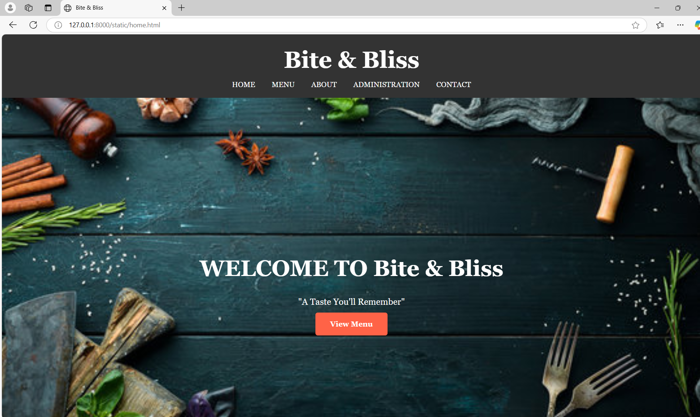
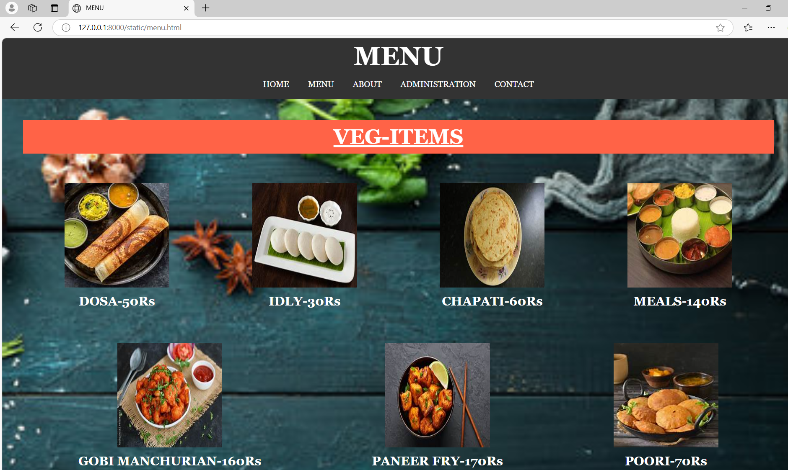
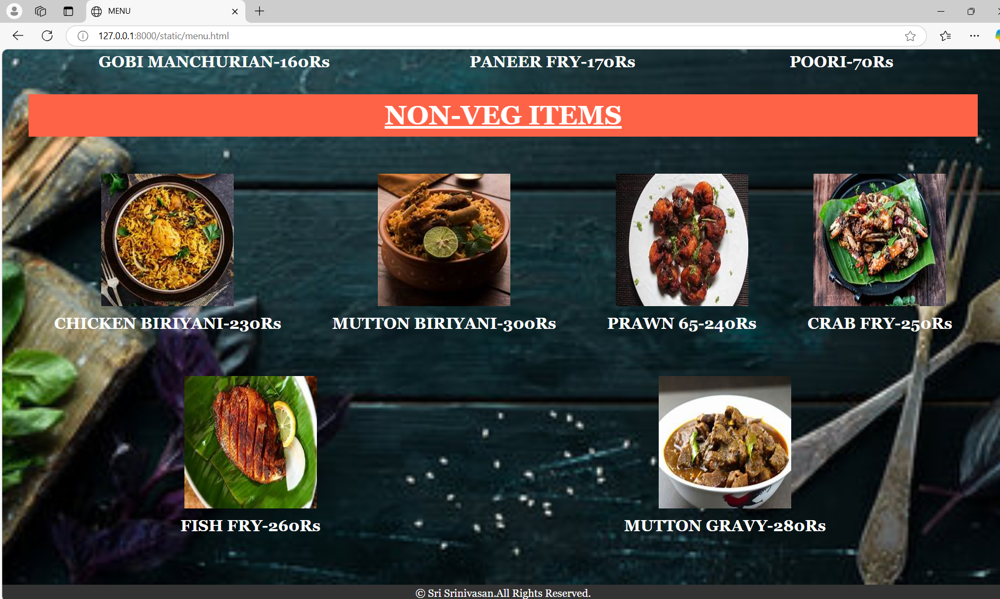
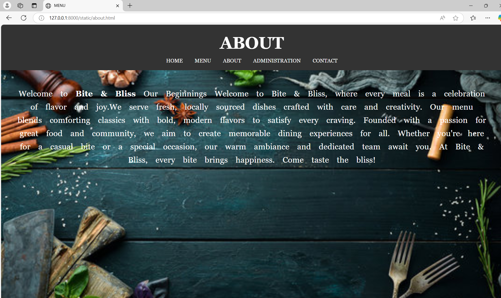
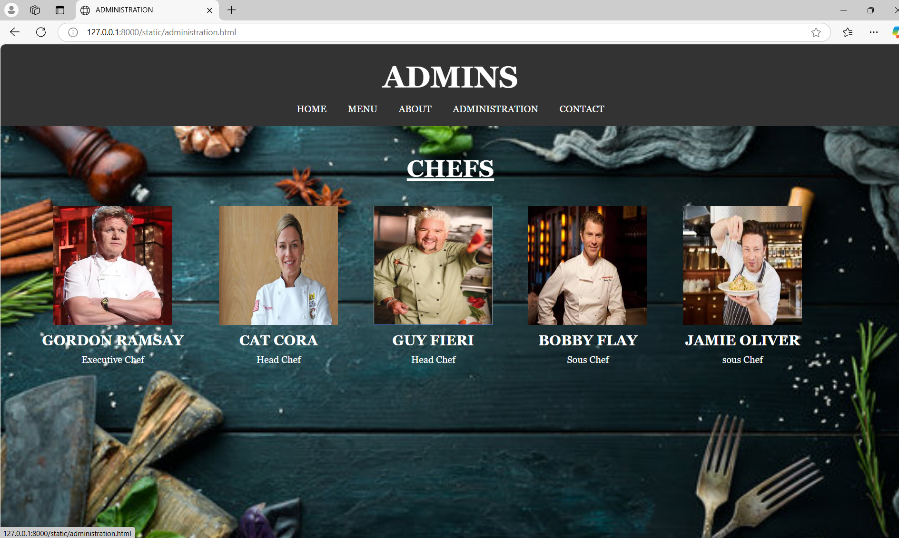
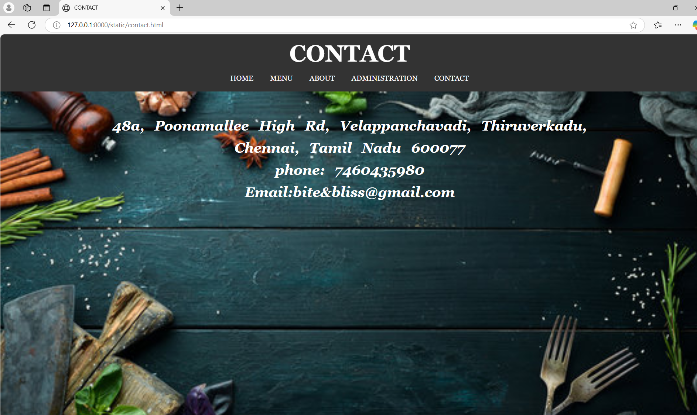

# Ex.07 Restaurant Website
## Date: 25-12-2024

## AIM:
To develop a static Restaurant website to display the food items and services provided by them.

## DESIGN STEPS:

### Step 1:
Requirement collection.

### Step 2:
Creating the layout using HTML and CSS.

### Step 3:
Updating the sample content.

### Step 4:
Choose the appropriate style and color scheme.

### Step 5:
Validate the layout in various browsers.

### Step 6:
Validate the HTML code.

### Step 7:
Publish the website in the given URL.

## PROGRAM:
```
home.html

<!DOCTYPE html>
<html lang="en">
<head>
    <meta charset="UTF-8">
    <meta name="viewport" content="width=device-width, initial-scale=1.0">
    <title>Bite & Bliss</title>
    <link rel="stylesheet" href="menu.css" type="text/css">
</head>
<body>
    <header>
        <div class="container">
            <h1>Bite & Bliss</h1>
            <ul>
                <li>
                    <a href="home.html">HOME</a>
                    <a href="menu.html">MENU</a>
                    <a href="about.html">ABOUT</a>
                    <a href="administration.html">ADMINISTRATION</a>
                    <a href="contact.html">CONTACT</a>
                </li>
            </ul>
        </div>
    </header>
    <section id="HOME" class="home-section">
        <div class="container">
            <h2>WELCOME TO Bite & Bliss</h2>
            <p>"A Taste You'll Remember"</p>
            <section class="home-section1">
            <a href="menu.html" class="button">View Menu</a>
            </section>
        </div>
    </section>
   <footer>
    <div class="container">
        <p>&copy; Sri Srinivasan.All Rights Reserved.</p>
    </div>
   </footer> 
</body>
</html>

menu.html
<!DOCTYPE html>
<html lang="en">
<head>
    <meta charset="UTF-8">
    <meta name="viewport" content="width=device-width, initial-scale=1.0">
    <title>MENU</title>
    <link rel="stylesheet" href="menu.css"
    type="text/css">
</head>
<body>
    <header id="menu">
    <div class="container">
        <h1 id="menu2">MENU</h1>
        <ul>
            <li>
                <a href="home.html">HOME</a>
                <a href="menu.html">MENU</a>
                <a href="about.html">ABOUT</a>
                <a href="administration.html">ADMINISTRATION</a>
                <a href="contact.html">CONTACT</a>
            </li>
        </ul>
 </div>
 </header>
 <section class="menu-section">
    <h1 id="veg">VEG-ITEMS</h1><br>
    <section class="menu-section1">
       <div>
       
       <h2>DOSA-50Rs</h2>
       </div>

       <div>
       
       <h2>IDLY-30Rs</h2>
       </div>

       <div>
       
       <h2>CHAPATI-60Rs</h2>
       </div>

       <div>
       
       <h2>MEALS-140Rs</h2>
       </div>

       <div>
       
       <h2>GOBI MANCHURIAN-160Rs</h2>
       </div>

       <div>
       
       <h2>PANEER FRY-170Rs</h2>
       </div>

       <div>
        
        <h2>POORI-70Rs</h2>
       </div>
       </section>

       <h1 id="nonveg">NON-VEG ITEMS</h1><BR>
       <section class="menu-section2">
        <div>
            
            <h2>CHICKEN BIRIYANI-230Rs</h2>
        </div>

        <div>
            
            <h2>MUTTON BIRIYANI-300Rs</h2>
        </div>

        <div>
            
            <h2>PRAWN 65-240Rs</h2>
        </div>

        <div>
            
            <h2>CRAB FRY-250Rs</h2>
        </div>

        <div>
            
            <h2>FISH FRY-260Rs</h2>
        </div>

        <div>
            
            <h2>MUTTON GRAVY-280Rs</h2>
        </div>
      </section>
 </section>
 <footer>
    <div class="container">
        <p>&copy; Sri Srinivasan.All Rights Reserved.</p>
    </div>
   </footer> 
</body>
</html>

about.html
<!DOCTYPE html>
<html lang="en">
<head>
    <meta charset="UTF-8">
    <meta name="viewport" content="width=<device-width>, initial-scale=1.0">
    <title>MENU</title>
    <link rel="stylesheet" href="menu.css"
    type="text/css">
</head>
<body>
    <header id="about">
        <div class="container">
        <h1>ABOUT</h1>
                <ul>
                    <li>
                        <a href="home.html">HOME</a>
                        <a href="menu.html">MENU</a>
                        <a href="about.html">ABOUT</a>
                        <a href="administration.html">ADMINISTRATION</a>
                        <a href="contact.html">CONTACT</a>
                    </li>
                </ul>
            </div>
    </header>
    <section class="about-section">
        <p id="ABOUT1">
            Welcome to <b>Bite & Bliss</b>
Our Beginnings

Welcome to Bite & Bliss, where every meal is a celebration of flavor and joy.We serve fresh, locally sourced dishes crafted with care and creativity. Our menu blends comforting classics with bold, modern flavors to satisfy every craving. Founded with a passion for great food and community, we aim to create memorable dining experiences for all. Whether you're here for a casual bite or a special occasion, our warm ambiance and dedicated team await you. At Bite & Bliss, every bite brings happiness. Come taste the bliss!
        </p>  
    </section>
    <footer>
        <div class="container">
            <p>&copy; Sri Srinivasan.All Rights Reserved.</p>
        </div>
       </footer> 
    </body>
</html>

administration.html
<!DOCTYPE html>
<html lang="en">
<head>
    <meta charset="UTF-8">
    <meta name="viewport" content="width=device-width, initial-scale=1.0">
    <title>ADMINISTRATION</title>
    <link rel="stylesheet" href="menu.css"
    type="text/css">
</head>
<body>
    <header id="ADMIN">
    <div class="container">
        <h1>ADMINS</h1>
        <ul>
            <li>
                <a href="home.html">HOME</a>
                <a href="menu.html">MENU</a>
                <a href="about.html">ABOUT</a>
                <a href="administration.html">ADMINISTRATION</a>
                <a href="contact.html">CONTACT</a>
            </li>
        </ul>
 </div>
 </header>
 <section class="admin-section">
    <h1 id="chef">CHEFS</h1>
    <section class="admin-section1">
    <div>
        
        <h2>GORDON RAMSAY</h2>
        <p>Executive Chef</p>
    </div>

    <div>
        
        <h2>CAT CORA</h2>
        <P>Head Chef</P>  
    </div>

    <div>
        
        <h2>GUY FIERI</h2>
        <p>Head Chef</p>
    </div>

    </section>
 </section>
 <footer>
    <div class="container">
        <p>&copy; Sri Srinivasan.All Rights Reserved.</p>
    </div>
   </footer> 
</body>
</html>

contact,html
!DOCTYPE html>
<html lang="en">
<head>
    <meta charset="UTF-8">
    <meta name="viewport" content="width=<device-width>, initial-scale=1.0">
    <title>CONTACT</title>
    <link rel="stylesheet" href="menu.css" type="text/css">
</head>
<body>
    <header id="CONTACT">
        <div class="container">
        <h1>CONTACT</h1>
                <ul>
                    <li>
                        <a href="home.html">HOME</a>
                        <a href="menu.html">MENU</a>
                        <a href="about.html">ABOUT</a>
                        <a href="administration.html">ADMINISTRATION</a>
                        <a href="contact.html">CONTACT</a>
                    </li>
                </ul>
            </div>
    </header>
    <section class="contact-section">
    <h2>
        <address>
            48a, Poonamallee High Rd, Velappanchavadi, Thiruverkadu,<br>
             Chennai, Tamil Nadu 600077<br>
            phone: 7460435980<br>
            Email:bite&bliss@gmail.com
       </address>
    </h2>
    </section>
    <footer>
        <div class="container">
            <p>&copy; Sri Srinivasan.All Rights Reserved.</p>
        </div>
       </footer> 
    </body>
    </html>

menu.css
.container{
    width: 80%;
    margin: 0 auto;
}
body{
    background-color: #f4f4f4;
    color: #333;
    line-height: 1.6;
}
header{
    background-color: #333;
    color: #fff;
    padding: 1em 0;
    text-align: center;
}
header h1{
    font-size: 50px;
    text-align: center;
}
.home-section{
    background-image: url('https://t4.ftcdn.net/jpg/02/78/69/37/360_F_278693728_O7t0fe2oDwwucHisBR1i8UhVxE5N229G.jpg');
    background-size: cover;
    background-position: center;
    align-items: center;
    text-align: center;
    color: #fff;
    height: 100vh;
    justify-content: center;
    display: flex;
}
.home-section h2{
    font-size: 3rem;
    text-align: center;
    align-items: center;
}
.home-section p{
    font-size: 1.2rem;
    margin: 1em 0;
    text-align: center;
    align-items: center;
}
ul{
    list-style: none;
    text-align: center;
    word-spacing: 2em;
}
ul li a{
    color: #fff;
    text-decoration: none;
}
h2{
    align-items: center;
    text-align: center;
}
p{
    align-items: center;
    text-align: center;
}
*{
    margin: 0;
    padding: 0;
    box-sizing: border-box;
    font-family: Georgia, 'Times New Roman', Times, serif;
}

#about{
    background-color: #333;
    color: #fff;
    padding: 1em 0;
    text-align: center;
    align-items: center;
}
.about-section{
    background-image: url('https://t4.ftcdn.net/jpg/02/78/69/37/360_F_278693728_O7t0fe2oDwwucHisBR1i8UhVxE5N229G.jpg');
    background-size: cover;
    background-position: center;
    align-items: center;
    text-align: justify;
    color: #fff;
    font-size: 25px;
    height: 100vh;
    word-spacing: 0.7em;
    padding: 50px;
}
#contact{
    background-color: #333;
    color: #fff;
    align-items: center;
    text-align: center;
    padding: 1em 0;
}
.contact-section{
    background-image: url('https://t4.ftcdn.net/jpg/02/78/69/37/360_F_278693728_O7t0fe2oDwwucHisBR1i8UhVxE5N229G.jpg');
    background-position: center;
    background-size: cover;
    text-align: center;
    align-items: center;
    color: #fff;
    height: 100vh;
    font-size: 20px;
    font-family: cursive;
    word-spacing: 0.7em;
    padding: 50px;
}
#menu{
    background-color: #333;
    color: #fff;
    padding: 1em 0;
    text-align: center;
    align-items: center;
}
.menu-section{
    background-image: url('https://t4.ftcdn.net/jpg/02/78/69/37/360_F_278693728_O7t0fe2oDwwucHisBR1i8UhVxE5N229G.jpg');
    background-position: center;
    background-size: cover;
    color: #fff;
    size: 20px;
    padding: 40px;
    align-items: center;
    text-align: center;
}
.menu-section1{
    display: flex;
    flex-wrap: wrap;
    justify-content: space-around;
}
.menu-section1 div{
    margin: 30px;
    align-items: center;
    text-align: center;
}
.menu-section2{
    display: flex;
    flex-wrap: wrap;
    justify-content: space-around;
}
.menu-section2 div{
    margin: 30px;
    align-items: center;
    text-align: center;
}
#veg{
    text-decoration: underline;
    font-style: bold;
    font-size: 40px;
    background-color: #ff6347;
}
#nonveg{
    text-decoration: underline;
    font-size: 40px;
    font-style: bold;
    background-color: #ff6347;
}
.admin-section{
    background-image: url('https://t4.ftcdn.net/jpg/02/78/69/37/360_F_278693728_O7t0fe2oDwwucHisBR1i8UhVxE5N229G.jpg');
    background-position: center;
    background-size: cover;
    height: 100vh;
    color: #fff;
    size: 20px;
    padding: 40px;
    align-items: center;
    text-align: center;
}
.admin-section1{
    display: flex;
    align-items: center;
    text-align: center;
    flex-wrap: wrap;
}
.admin-section div{
    text-align: center;
    align-items: center;
    margin: 30px;
}
#chef{
    font-size: bold;
    text-decoration: underline;
    font-size: 40px;
}
footer{
    background-color: #333;
    color: #fff;
    text-align: center;
    padding: 1em o;
}
.button{
    background-color: #ff6347;
    color: #fff;
    padding: 1em 2em;
    text-decoration: none;
    font-weight: bold;
    border-radius: 5px;
}

```

## OUTPUT:








## RESULT:
The program for designing software company website using HTML and CSS is completed successfully.
